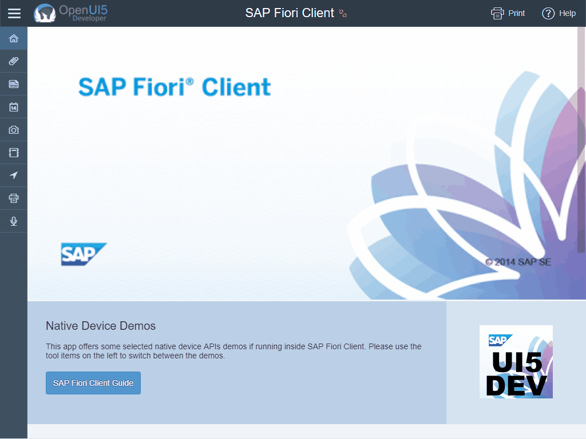

# FioriClient

## [OpenUI5 Developer Blog](http://openui5.blogspot.com/2017/08/fioriclient.html)

> [UI5](http://openui5.org/) demo showing native device features inside [SAP Fiori Client](https://uacp2.hana.ondemand.com/viewer/p/SAP_FIORI_CLIENT).

### [Online Demo (SAP HCP)](https://fioriclient-p1940953245trial.dispatcher.hanatrial.ondemand.com/index.html)

### Highlights
> - demo how to use native device features inside the [SAP Fiori Client](https://uacp2.hana.ondemand.com/viewer/p/SAP_FIORI_CLIENT)
> - detection of client inside bootstrap
> - custom QRCode control to render FioriURL for easy setup
> - [Plugin](https://uacp2.hana.ondemand.com/viewer/e2ed9b4f3edb4391a7a89b1af84d9606/3.0.15/en-US/dd84adc65a5e4a2490e52d2394b7d954.html) examples for:
>  - Attachment Viewer
>  - Barcode Scanner
>  - Calendar
>  - Camera
>  - Contacts
>  - Geolocation
>  - InAppBrowser
>  - Printer
>  - Voice Recording

## License

Released under the [Apache license](http://www.apache.org/licenses/). Have at it.